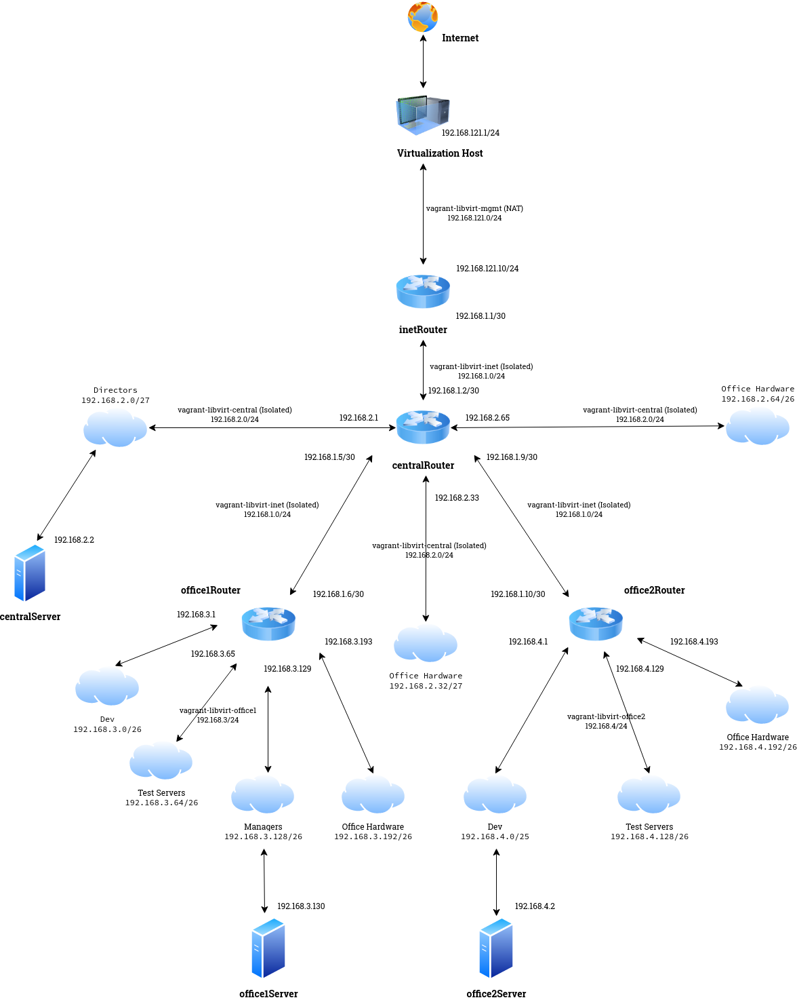

### Нстройка сетевого взаимодействия в виртуальной среде с помощью инструментов _Vagrant_ + _Libvirts_
Создадим виртуальную модель офисной сети в соответствии с прилагаемой схемой. 

Здесь есть четыре виртуальных машины, у которых на борту более одного сетевого интерфейса, не считая _lo_, и которые выполняют роль маршрутизаторов. Эти серверы имеют в своём имени постфикс _Router_:
  - __inetRouter__ - является шлюзом для доступа в Интернет для всех виртуальных хостов нашй модели офисной сети. Он получает входящие пакеты на изолированном интерфейсе сети _vagrant-libvirt-inet_ и переправляет его на свой внешний интерфейс _NAT_ в соответствуещей сети _vagrant\_libvirt\_mgmt_;
  - __centralRouter__ - является шлюзом для сервера _centralServer_, шлюзов _office1Router_ и _office2Router_, а также расположенными за этими роутерами, серверами - _office1Server_ и _office2Server_;
  - __office1Router__ - является шлюзом для сервера _office1Server_;
  - __office2Router__ - является шлюзом для сервера _office1Server_.

Также, на данной схеме присутствуют серверы с одним сетевым интерфейсом, которые имеют в своём имени постфикс - _Server_. Данные серверы являются конечными узлами сети без настроенного функционала маршрутизации пакетов между сетями.
> [!IMPORTANT]
> Так как _Vagrant_ для настройки сетевой подсистемы создаваемых виртуальных машин использует инструмент командной строки - _Networking_, для корректной работы, при использовании связки __Vagrant__ + __Libvirt__, убедитесь, что в исходном образе виртуальной машины не установлены или отключены такие службы управления сетевыми подключениями,
> как _NetworkManager_ или _Systemd-networkd_. Пример отключения _NetworkManager_: `systemctl mask --now NetworkManager`. Здесь вместо _disable_ используется ключ _mask_, который предотвращает запуск службы зависящими от неё приложениями и сервисами.
> В отличие от ключа _disable_, котрый удаляет символичискую ссылку из каталога _/etc/systemd/system_ на исполняемый файл и предотвращает только автоматический запуск службы во время загрузки системы, ключ _mask_ заменяет файл модуля службы символической ссылкой
> на _/dev/null_. Как создать образ виртуальной машины для дальнейшего использования его в качестве источника боксов _Vagrant_, описано [здесь](https://github.com/spanishairman/vagrant).

> [!TIP]
> Также, в исходном образе, на базе которого создаётся _box_ виртуальной машины, рекомендуется заранее установить пакет _resolvconf_. Это необходимо для того, чтобы обеспечить функционал разрешения имён в виртуальной машине. 
> Так, если вы запускаете _Vagrantfile_, в котором есть описание нескольких сетевых интерфейсов, и,  если хотя бы одно из которых создаст изолированную виртуальную сеть с получением адреса по протоколу _dhcp_, 
> то _dhcp_-клиент на созданной  машине перепишет файл _/etc/resolv.conf_ с указанием адреса _DNS_-сервера, доступного на этом интерфейсе (адрес хостовой машины в этой сети). А так как тип виртуальной сети - _Isolated_, то никакие запросы 
> со стороны виртуальной машины во внешние сети не пропускаются, включая запроы разрешения имён. В данном случае, _Resolvconf_, дописывает настройки подключения к службам  разрешения имён по мере инициализации сетевых интерфейсов, не позволяя _dhcp_-клиенту 
> переписывать их.

На вышеуказанной схеме приведены следующие сети:
  - __vagrant-libvirt-mgmt__ - сеть управления, тип NAT. К данной сети подключаются все создаваемые _Vagrant_ виртуальные машины, а также выполняется первоначальная настройка - _Provisioning_ и дальнйейшее администрование машин;
  - __vagrant-libvirt-inet__ - сеть между шлюзом в Интернет - _inetRouter_ и шлюзом для всех виртуальных сетей офиса - _centralRouter_, а также для связи между собой всех роутеров;
  - __vagrant-libvirt-central__ - сеть центрального офиса, шлюз по умолчанию для всех хостов в этой сети - _centralRouter_ ;
  - __vagrant-libvirt-office1__ - сеть первого удалённого оофиса, шлюз по умолчанию для всех хостов в этой сети - _office1Router_;
  - __vagrant-libvirt-office2__ - сеть второго удалённого офиса, шлюз по умолчанию для всех хостов в этой сети - _office2Router_.

Все указанные сети имеют маску - 24 и могут содержать диапазон из 256 IP-адресов, из которых один адрес - адрес самой сети и один широковещательный адрес. Итого фактическая ёмкость сети - 254 адреса. 
При создании виртуальных машин, Vagrant проверяет наличие виртуальной сети, имя которой содержится в описании машины и, если такая сеть уже существует, то он будет использовать её без изменения ранее заданных для нёё параметров.
Это позволяет использовать одну крупную виртуальную сеть с 24-й маской, к которой подключены машины с настроенными сетевыми адаптерами на меньшую ёмкость сети. 
Например, к заранее настроеной сети _192.168.3.0/24_ можно подключать виртуальные машины, в которых настроены интерфейсы для работы в сетях _192.168.3.0/26_, _192.168.3.64/26_, _192.168.3.128/26_ и _192.168.3.192/26_.
Примеры описания виртуальных сетей - _vagrant-libvirt-inet.xml_, здесь указан тип сети - _NAT_:
```
<network ipv6='no'>
  <name>vagrant-libvirt-inet</name>
  <uuid>f0bdcbfd-4f62-46f2-b1ec-c4e3edcd537c</uuid>
  <forward mode="nat">
    <nat>
      <port start="1024" end="65535"/>
    </nat>
  </forward>
  <bridge name="virbr5" stp="on" delay="0"/>
  <mac address="52:54:00:ff:c2:3c"/>
  <domain name="vagrant-libvirt-inet"/>
  <ip address="192.168.1.1" netmask="255.255.255.0">
    <dhcp>
      <range start="192.168.1.128" end="192.168.1.254"/>
    </dhcp>
  </ip>
</network>
```
В случае, если в файле описания сети не указан тип - _NAT_, то будет создана изолированная сеть. Например _vagrant-libvirt-central.xml_:
```
<network ipv6='no'>
  <name>vagrant-libvirt-central</name>
  <uuid>102cf8a8-d77f-414f-8f31-d95671c846ad</uuid>
  <bridge name="virbr4" stp="on" delay="0"/>
  <mac address="52:54:00:cc:48:93"/>
  <domain name="vagrant-libvirt-central"/>
  <ip address="192.168.2.1" netmask="255.255.255.0">
    <dhcp>
      <range start='192.168.2.31' end='192.168.2.254'/>
    </dhcp>
  </ip>
</network>
```

Все файлы описания виртуальных сетей прилагаются в данном репозитории. Для их запуска можно использовать такой скрипт (тоже [прилагается](vagrant-net-load-central.sh)):
```
#!/bin/bash
if [ ! $(virsh net-list | grep central) ];
    then
        virsh net-define vagrant-libvirt-central.xml
        virsh net-start vagrant-libvirt-central
fi
if [ ! $(virsh net-list | grep inet) ];
    then
        virsh net-define vagrant-libvirt-inet.xml
        virsh net-start vagrant-libvirt-inet
fi
if [ ! $(virsh net-list | grep office1) ];
    then
        virsh net-define vagrant-libvirt-office1.xml
        virsh net-start vagrant-libvirt-office1
fi
if [ ! $(virsh net-list | grep office2) ];
    then
        virsh net-define vagrant-libvirt-office2.xml
        virsh net-start vagrant-libvirt-office2
fi
virsh net-list
```
Так выглядит блок настроек с сетевыми параметрами для виртуальной машины в [_Vagrantfile_](Vagrantfile]:
```
  centralrouter.vm.network :private_network,
       :type => 'ip',
       :ip => '192.168.2.5',
       :libvirt__netmask => '255.255.255.252',
       :libvirt__network_name => 'vagrant-libvirt-central',
       :libvirt__always_destroy => 'false'
```
