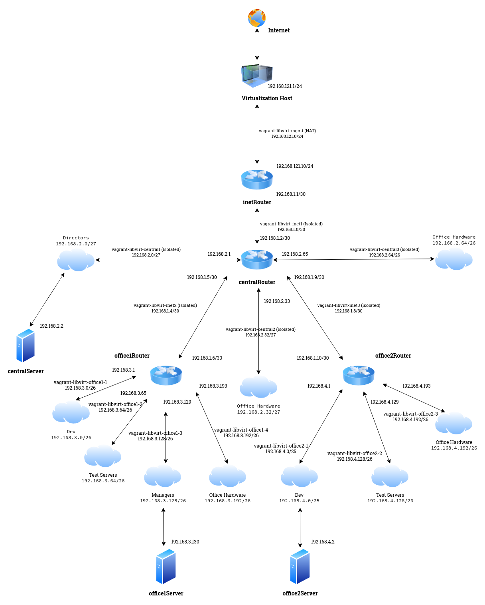

### Нстройка сетевого взаимодействия в виртуальной среде с помощью инструментов _Vagrant_ + _Libvirts_
#### Схема сети. Общее описание
Создадим виртуальную модель офисной сети в соответствии с прилагаемой схемой. 

Здесь есть четыре виртуальных машины, у которых на борту более одного сетевого интерфейса, не считая _lo_, и которые выполняют роль маршрутизаторов. Эти серверы имеют в своём имени постфикс _Router_:
  - __inetRouter__ - является шлюзом для доступа в Интернет для всех виртуальных хостов нашй модели офисной сети. Он получает входящие пакеты на изолированном интерфейсе сети _vagrant-libvirt-inet_ и переправляет его на свой внешний интерфейс _NAT_ в соответствуещей сети _vagrant\_libvirt\_mgmt_;
  - __centralRouter__ - является шлюзом для сервера _centralServer_, шлюзов _office1Router_ и _office2Router_, а также расположенными за этими роутерами, серверами - _office1Server_ и _office2Server_;
  - __office1Router__ - является шлюзом для сервера _office1Server_;
  - __office2Router__ - является шлюзом для сервера _office1Server_.

Также, на данной схеме присутствуют серверы с одним сетевым интерфейсом, которые имеют в своём имени постфикс - _Server_. Данные серверы являются конечными узлами сети без настроенного функционала маршрутизации пакетов между сетями.
> [!IMPORTANT]
> Так как _Vagrant_ для настройки сетевой подсистемы создаваемых виртуальных машин использует инструмент командной строки - _Networking_, для корректной работы, при использовании связки __Vagrant__ + __Libvirt__, убедитесь, что в исходном образе виртуальной машины не установлены или отключены такие службы управления сетевыми подключениями,
> как _NetworkManager_ или _Systemd-networkd_. Пример отключения _NetworkManager_: `systemctl mask --now NetworkManager`. Здесь вместо _disable_ используется ключ _mask_, который предотвращает запуск службы зависящими от неё приложениями и сервисами.
> В отличие от ключа _disable_, котрый удаляет символичискую ссылку из каталога _/etc/systemd/system_ на исполняемый файл и предотвращает только автоматический запуск службы во время загрузки системы, ключ _mask_ заменяет файл модуля службы символической ссылкой
> на _/dev/null_. Как создать образ виртуальной машины для дальнейшего использования его в качестве источника боксов _Vagrant_, описано [здесь](https://github.com/spanishairman/vagrant).

> [!TIP]
> Также, в исходном образе, на базе которого создаётся _box_ виртуальной машины, рекомендуется заранее установить пакет _resolvconf_. Это необходимо для того, чтобы обеспечить функционал разрешения имён в виртуальной машине. 
> Так, если вы запускаете _Vagrantfile_, в котором есть описание нескольких сетевых интерфейсов, и,  если хотя бы одно из которых создаст изолированную виртуальную сеть с получением адреса по протоколу _dhcp_, 
> то _dhcp_-клиент на созданной  машине перепишет файл _/etc/resolv.conf_ с указанием адреса _DNS_-сервера, доступного на этом интерфейсе (адрес хостовой машины в этой сети). А так как тип виртуальной сети - _Isolated_, то никакие запросы 
> со стороны виртуальной машины во внешние сети не пропускаются, включая запроы разрешения имён. В данном случае, _Resolvconf_, дописывает настройки подключения к службам  разрешения имён по мере инициализации сетевых интерфейсов, не позволяя _dhcp_-клиенту 
> переписывать их.

На вышеуказанной схеме приведены следующие сети:
  - __vagrant-libvirt-mgmt__ - сеть управления, тип NAT. К данной сети подключаются все создаваемые _Vagrant_ виртуальные машины, а также выполняется первоначальная настройка - _Provisioning_ и дальнйейшее администрование машин;
  - __vagrant-libvirt-inet__ - сеть между шлюзом в Интернет - _inetRouter_ и шлюзом для всех виртуальных сетей офиса - _centralRouter_, а также для связи между собой всех роутеров;
  - __vagrant-libvirt-central__ - сеть центрального офиса. Шлюз по умолчанию для всех хостов в этой сети - _centralRouter_ ;
  - __vagrant-libvirt-office1__ - сеть первого удалённого оофиса. Шлюз по умолчанию для всех хостов в этой сети - _office1Router_;
  - __vagrant-libvirt-office2__ - сеть второго удалённого офиса. Шлюз по умолчанию для всех хостов в этой сети - _office2Router_.

Все указанные сети имеют маску _24_ и содержат диапазон из _256_ IP-адресов, один из которых - адрес самой сети и один широковещательный адрес. Итого фактическая ёмкость сети - _254_ адреса. 
> [!NOTE]
> При создании виртуальных машин, _Vagrant_, в случае наличия виртуальной сети, имя которой содержится в описании машины, будет использовать её без изменения ранее заданных для нёё параметров.
> При этом в настройках виртуальной машины будет создан сетевой интерфейс с теми настройками, которые заданы в _Vagrantfile_.
> Это позволяет использовать одну крупную виртуальную сеть с 24-й маской, к которой подключены машины с настроенными сетевыми адаптерами на меньшую ёмкость сети. 
> Например, к заранее настроеной сети _192.168.3.0/24_ можно подключать виртуальные машины, в которых настроены интерфейсы для работы в сетях _192.168.3.0/26_, _192.168.3.64/26_, _192.168.3.128/26_ и _192.168.3.192/26_.

Примеры описания виртуальных сетей. _vagrant-libvirt-inet.xml_ - здесь указан тип сети - _NAT_:
```
<network ipv6='no'>
  <name>vagrant-libvirt-inet</name>
  <uuid>f0bdcbfd-4f62-46f2-b1ec-c4e3edcd537c</uuid>
  <forward mode="nat">
    <nat>
      <port start="1024" end="65535"/>
    </nat>
  </forward>
  <bridge name="virbr5" stp="on" delay="0"/>
  <mac address="52:54:00:ff:c2:3c"/>
  <domain name="vagrant-libvirt-inet"/>
  <ip address="192.168.1.1" netmask="255.255.255.0">
    <dhcp>
      <range start="192.168.1.128" end="192.168.1.254"/>
    </dhcp>
  </ip>
</network>
```
В случае, если в файле описания сети не указан тип _NAT_, то будет создана изолированная сеть. Например _vagrant-libvirt-central.xml_:
```
<network ipv6='no'>
  <name>vagrant-libvirt-central</name>
  <uuid>102cf8a8-d77f-414f-8f31-d95671c846ad</uuid>
  <bridge name="virbr4" stp="on" delay="0"/>
  <mac address="52:54:00:cc:48:93"/>
  <domain name="vagrant-libvirt-central"/>
  <ip address="192.168.2.1" netmask="255.255.255.0">
    <dhcp>
      <range start='192.168.2.31' end='192.168.2.254'/>
    </dhcp>
  </ip>
</network>
```

Все файлы описания виртуальных сетей прилагаются в данном репозитории. Для их запуска можно использовать такой [скрипт](vagrant-net-load-central.sh)):
```
#!/bin/bash
if [ ! $(virsh net-list | grep central) ];
    then
        virsh net-define vagrant-libvirt-central.xml
        virsh net-start vagrant-libvirt-central
fi
if [ ! $(virsh net-list | grep inet) ];
    then
        virsh net-define vagrant-libvirt-inet.xml
        virsh net-start vagrant-libvirt-inet
fi
if [ ! $(virsh net-list | grep office1) ];
    then
        virsh net-define vagrant-libvirt-office1.xml
        virsh net-start vagrant-libvirt-office1
fi
if [ ! $(virsh net-list | grep office2) ];
    then
        virsh net-define vagrant-libvirt-office2.xml
        virsh net-start vagrant-libvirt-office2
fi
virsh net-list
```
Так выглядит блок настроек с сетевыми параметрами для виртуальной машины в [_Vagrantfile_](Vagrantfile):
```
  centralrouter.vm.network :private_network,
       :type => 'ip',
       :ip => '192.168.2.5',
       :libvirt__netmask => '255.255.255.252',
       :libvirt__network_name => 'vagrant-libvirt-central',
       :libvirt__always_destroy => 'false'
```

Также можно использовать виртуальные сети, создаваемые непосредственно во время инициализации машин. 

Немного изменим схему:

Здесь у сетей _vagrant-libvirt-central_, _vagrant-libvirt-inet_, _vagrant-libvirt-office1_ и _vagrant-libvirt-office2_ появились числовые индексы и сами сети стали меньше по маске.

Пример файла для описания сети [vagrant-libvirt-central1](files/vagrant-libvirt-central1.xml):
```
<network connections='2' ipv6='no'>
  <name>vagrant-libvirt-central1</name>
  <uuid>5bcffc9b-99c4-4b28-a621-292c84eefe80</uuid>
  <bridge name='virbr8' stp='on' delay='0'/>
  <mac address='52:54:00:33:9c:d6'/>
  <ip address='192.168.2.1' netmask='255.255.255.224'>
  </ip>
</network>
```
Файл описания сети [vagrant-libvirt-central2](files/vagrant-libvirt-central2.xml):
```
<network connections='1' ipv6='no'>
  <name>vagrant-libvirt-central2</name>
  <uuid>9ca9af04-327f-48c5-ab7a-9550a426af55</uuid>
  <bridge name='virbr9' stp='on' delay='0'/>
  <mac address='52:54:00:77:2f:d4'/>
  <ip address='192.168.2.33' netmask='255.255.255.224'>
  </ip>
</network>

```
Пример [скрипта](files/vagrant-net-load-central.sh), создающего и запускаещего все необходимые сети:
```
#!/bin/bash
for i in {1..3}; do
if [ ! $(virsh net-list | grep central$i) ];
    then
        virsh net-define vagrant-libvirt-central$i.xml
        virsh net-start vagrant-libvirt-central$i
fi;
done
for i in {1..3}; do
if [ ! $(virsh net-list | grep inet$i) ];
    then
        virsh net-define vagrant-libvirt-inet$i.xml
        virsh net-start vagrant-libvirt-inet$i
fi;
done
for i in {1..4}; do
if [ ! $(virsh net-list | grep office1-$i) ];
    then
        virsh net-define vagrant-libvirt-office1-$i.xml
        virsh net-start vagrant-libvirt-office1-$i
fi;
done
for i in {1..3}; do
if [ ! $(virsh net-list | grep office2-$i) ];
    then
        virsh net-define vagrant-libvirt-office2-$i.xml
        virsh net-start vagrant-libvirt-office2-$i
fi;
done
if [ ! $(virsh net-list | grep vagrant-libvirt-mgmt) ];
    then
        virsh net-define vagrant-libvirt-mgmt.xml
        virsh net-start vagrant-libvirt-mgmt
fi;
virsh net-list
```

#### Настройка правил и маршрутов

На всех виртуальных машинах, выполняющих роль маршрутизаторов, разрешим прохождение транзитного трафика:
```
echo "net.ipv4.conf.all.forwarding = 1" >> /etc/sysctl.conf
sysctl -p
```
На сервере _inetRouter_ дополнительно добавим правило файервола, которое включит трансляцию адресов:
```
iptables -t nat -A POSTROUTING ! -d 192.168.0.0/16 -o ens5 -j MASQUERADE
```
Возможно, перед этим портебуется установить пакет _iptables_:
```
apt install -y iptables
```
На всех виртуальных машинах, кроме _inetRouter_, изменим маршрут по умолчанию, который изначально, при создании и запуске мышины, указывает на _ip_-адрес хоста в сети управления. 
Например, для _centralRouter_ укажем _ip_-адрес виртуального хоста _inetRouter_, подключенного к сети _vagrant-libvirt-inet1_. 
Для _office1Router_ - _ip_-адрес машины _centralRouter_, принадлежащий сети _vagrant-libvirt-inet2_, и т.д. Пример для _centralRouter_:
```
ip route del 0.0.0.0/0
ip route add 0.0.0.0/0 via 192.168.1.1
```
Или так:
```
ip route del default
ip route add default via 192.168.1.1
```

Все вышеуказанные примеры содержатся в прилагаемом _Vagrantfile_.

Для _inetRouter_ не требуется изменять маршрут по умолчанию, но необходимо добавить маршруты до сетей, находящихся за _centralRouter_:
```
ip route add 192.168.1.4/30 via 192.168.1.2
ip route add 192.168.1.8/30 via 192.168.1.2
ip route add 192.168.2.0/24 via 192.168.1.2
ip route add 192.168.3.0/24 via 192.168.1.2
ip route add 192.168.4.0/24 via 192.168.1.2
```
Для centralRouter, как и для всех остальных хостов, кроме _inetRouter_ потребуется изменить маршрут по умолчанию. Также  для него нужно прописать маршруты до сетей, находящихся за _office1Router_ и _office2Router_:
```
ip route del default
ip route add default via 192.168.1.1
ip route add 192.168.3.0/24 via 192.168.1.6
ip route add 192.168.4.0/24 via 192.168.1.10
```
Проверим, как работают созданные статические маршруты, залогинимся по _ssh_ на сервере _inetRouter_ и проверим таблицу маршрутизации:
```
max@localhost:~/vagrant/vg3> vagrant ssh Debian12-inetRouter 
==> Debian12-inetRouter: You assigned a static IP ending in ".1" to this machine.
==> Debian12-inetRouter: This is very often used by the router and can cause the
==> Debian12-inetRouter: network to not work properly. If the network doesn't work
==> Debian12-inetRouter: properly, try changing this IP.
Linux inetrouter 6.1.0-25-amd64 #1 SMP PREEMPT_DYNAMIC Debian 6.1.106-3 (2024-08-26) x86_64

The programs included with the Debian GNU/Linux system are free software;
the exact distribution terms for each program are described in the
individual files in /usr/share/doc/*/copyright.

Debian GNU/Linux comes with ABSOLUTELY NO WARRANTY, to the extent
permitted by applicable law.
Last login: Mon Sep 30 11:45:32 2024
vagrant@inetrouter:~$ ip route 
default via 192.168.121.1 dev ens5 
192.168.1.0/30 dev ens6 proto kernel scope link src 192.168.1.1 
192.168.1.4/30 via 192.168.1.2 dev ens6 
192.168.1.8/30 via 192.168.1.2 dev ens6 
192.168.2.0/24 via 192.168.1.2 dev ens6 
192.168.3.0/24 via 192.168.1.2 dev ens6 
192.168.4.0/24 via 192.168.1.2 dev ens6 
192.168.121.0/24 dev ens5 proto kernel scope link src 192.168.121.10
```
Запустим пинг последовательно на хосты _centralRouter_, _office1Router_ и _office1Server_:
```
vagrant@inetrouter:~$ ping 192.168.1.2
PING 192.168.1.2 (192.168.1.2) 56(84) bytes of data.
64 bytes from 192.168.1.2: icmp_seq=7 ttl=66 time=0.422 ms
64 bytes from 192.168.1.2: icmp_seq=8 ttl=66 time=0.380 ms
64 bytes from 192.168.1.2: icmp_seq=9 ttl=66 time=0.412 ms
64 bytes from 192.168.1.2: icmp_seq=10 ttl=66 time=0.293 ms
64 bytes from 192.168.1.2: icmp_seq=11 ttl=66 time=0.349 ms
^C
--- 192.168.1.2 ping statistics ---
11 packets transmitted, 5 received, 54.5455% packet loss, time 10233ms
rtt min/avg/max/mdev = 0.293/0.371/0.422/0.046 ms
vagrant@inetrouter:~$ ping 192.168.1.5
PING 192.168.1.5 (192.168.1.5) 56(84) bytes of data.
64 bytes from 192.168.1.5: icmp_seq=1 ttl=66 time=0.307 ms
64 bytes from 192.168.1.5: icmp_seq=2 ttl=66 time=0.349 ms
64 bytes from 192.168.1.5: icmp_seq=3 ttl=66 time=0.350 ms
^C
--- 192.168.1.5 ping statistics ---
3 packets transmitted, 3 received, 0% packet loss, time 2029ms
rtt min/avg/max/mdev = 0.307/0.335/0.350/0.020 ms
vagrant@inetrouter:~$ ping 192.168.3.130
PING 192.168.3.130 (192.168.3.130) 56(84) bytes of data.
64 bytes from 192.168.3.130: icmp_seq=6 ttl=64 time=0.868 ms
64 bytes from 192.168.3.130: icmp_seq=38 ttl=64 time=0.950 ms
64 bytes from 192.168.3.130: icmp_seq=39 ttl=64 time=0.865 ms
64 bytes from 192.168.3.130: icmp_seq=40 ttl=64 time=1.04 ms
64 bytes from 192.168.3.130: icmp_seq=41 ttl=64 time=0.922 ms
64 bytes from 192.168.3.130: icmp_seq=42 ttl=64 time=0.913 ms
^C
--- 192.168.3.130 ping statistics ---
42 packets transmitted, 6 received, 85.7143% packet loss, time 41875ms
rtt min/avg/max/mdev = 0.865/0.926/1.042/0.059 ms
vagrant@inetrouter:~$ ping 192.168.4.2
PING 192.168.4.2 (192.168.4.2) 56(84) bytes of data.
64 bytes from 192.168.4.2: icmp_seq=6 ttl=64 time=1.11 ms
64 bytes from 192.168.4.2: icmp_seq=7 ttl=64 time=1.03 ms
64 bytes from 192.168.4.2: icmp_seq=8 ttl=64 time=0.833 ms
64 bytes from 192.168.4.2: icmp_seq=9 ttl=64 time=0.825 ms
64 bytes from 192.168.4.2: icmp_seq=10 ttl=64 time=0.899 ms
64 bytes from 192.168.4.2: icmp_seq=11 ttl=64 time=0.869 ms
64 bytes from 192.168.4.2: icmp_seq=12 ttl=64 time=1.36 ms
^C
--- 192.168.4.2 ping statistics ---
12 packets transmitted, 7 received, 41.6667% packet loss, time 11151ms
rtt min/avg/max/mdev = 0.825/0.990/1.363/0.181 ms
```
Мы видим, что при запуске команды _ping_ происходит потеря пакетов. Это вызвано тем, что для взаимодействия с соседними узлами сети, хосту необходимо узнать их машинные адреса и построить _arp_-таблицу, связывающую _ip_-адреса хостов с их _mac_-адресами. 
В дальнейшем обращене к этим хостам происходит без задержек.

Пример _arp_-таблиц на _inetRouter_ и _centralRouter_ после выполнения пинга:
```
root@inetrouter:~# cat /proc/net/arp 
IP address       HW type     Flags       HW address            Mask     Device
192.168.121.1    0x1         0x2         52:54:00:43:65:2b     *        ens5
192.168.1.2      0x1         0x2         52:54:00:35:17:68     *        ens6

root@centralrouter:~# cat /proc/net/arp 
IP address       HW type     Flags       HW address            Mask     Device
192.168.1.6      0x1         0x2         52:54:00:47:29:a0     *        ens10
192.168.2.2      0x1         0x2         52:54:00:6f:9f:a8     *        ens6
192.168.121.1    0x1         0x2         52:54:00:43:65:2b     *        ens5
192.168.1.10     0x1         0x2         52:54:00:ce:1c:0d     *        ens11
192.168.1.1      0x1         0x2         52:54:00:af:64:e8     *        ens9
```
Проверим, что повторный запуск пинга происходит без задержек и потерь пакетов. Запустим _ping_ узла _office2Server_ с _inetRouter_:
```
max@localhost:~/vagrant/vg3> vagrant ssh Debian12-inetRouter 
==> Debian12-inetRouter: You assigned a static IP ending in ".1" to this machine.
==> Debian12-inetRouter: This is very often used by the router and can cause the
==> Debian12-inetRouter: network to not work properly. If the network doesn't work
==> Debian12-inetRouter: properly, try changing this IP.
^[[ALinux inetrouter 6.1.0-25-amd64 #1 SMP PREEMPT_DYNAMIC Debian 6.1.106-3 (2024-08-26) x86_64

The programs included with the Debian GNU/Linux system are free software;
the exact distribution terms for each program are described in the
individual files in /usr/share/doc/*/copyright.

Debian GNU/Linux comes with ABSOLUTELY NO WARRANTY, to the extent
permitted by applicable law.
Last login: Fri Oct  4 10:57:23 2024 from 192.168.121.1
vagrant@inetrouter:~$ ping 192.168.4.2
PING 192.168.4.2 (192.168.4.2) 56(84) bytes of data.
64 bytes from 192.168.4.2: icmp_seq=1 ttl=64 time=0.857 ms
64 bytes from 192.168.4.2: icmp_seq=2 ttl=64 time=0.939 ms
64 bytes from 192.168.4.2: icmp_seq=3 ttl=64 time=0.835 ms
^C
--- 192.168.4.2 ping statistics ---
3 packets transmitted, 3 received, 0% packet loss, time 2003ms
rtt min/avg/max/mdev = 0.835/0.877/0.939/0.044 ms
```
Сделаем тоже самое для сервера _office2Server_, запустим с него пинг сервера _centralServer_:
```
vagrant@office2server:~$ ping 192.168.2.2
PING 192.168.2.2 (192.168.2.2) 56(84) bytes of data.
64 bytes from 192.168.2.2: icmp_seq=7 ttl=64 time=1.07 ms
64 bytes from 192.168.2.2: icmp_seq=8 ttl=64 time=0.832 ms
64 bytes from 192.168.2.2: icmp_seq=9 ttl=64 time=0.893 ms
64 bytes from 192.168.2.2: icmp_seq=10 ttl=64 time=0.893 ms
64 bytes from 192.168.2.2: icmp_seq=11 ttl=64 time=0.877 ms
64 bytes from 192.168.2.2: icmp_seq=12 ttl=64 time=0.914 ms
64 bytes from 192.168.2.2: icmp_seq=13 ttl=64 time=1.01 ms
^C
--- 192.168.2.2 ping statistics ---
13 packets transmitted, 7 received, 46.1538% packet loss, time 12149ms
rtt min/avg/max/mdev = 0.832/0.926/1.067/0.075 ms
vagrant@office2server:~$ ping 192.168.2.2
PING 192.168.2.2 (192.168.2.2) 56(84) bytes of data.
64 bytes from 192.168.2.2: icmp_seq=1 ttl=64 time=0.758 ms
64 bytes from 192.168.2.2: icmp_seq=2 ttl=64 time=0.925 ms
64 bytes from 192.168.2.2: icmp_seq=3 ttl=64 time=0.872 ms
64 bytes from 192.168.2.2: icmp_seq=4 ttl=64 time=0.983 ms
64 bytes from 192.168.2.2: icmp_seq=5 ttl=64 time=0.919 ms
64 bytes from 192.168.2.2: icmp_seq=6 ttl=64 time=1.05 ms
^C
--- 192.168.2.2 ping statistics ---
6 packets transmitted, 6 received, 0% packet loss, time 5007ms
rtt min/avg/max/mdev = 0.758/0.917/1.048/0.090 ms
```
Здесь так же, первый запуск команды происходит с задержкой и потерей пакетов - `13 packets transmitted, 7 received, 46.1538% packet loss`, во второй раз видим `6 packets transmitted, 6 received, 0% packet loss`.
